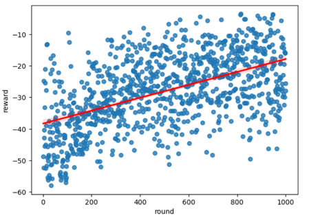

# Bomberman — Mô tả dự án

## Nguồn gốc / Tài liệu tham khảo
Phần framework trò chơi và cấu trúc cơ bản của project này được lấy cảm hứng (và/hoặc dựa trên) repository gốc:

- https://github.com/ukoethe/bomberman_rl

Đây là kho mã nguồn cho đồ án cuối kỳ (dự án học phần) triển khai các phương pháp học tăng cường (reinforcement learning) trên framework trò chơi Bomberman.


Mục tiêu của dự án:
- Thiết kế và triển khai agents chơi Bomberman (từ rule-based đến agent học được).
- Tiền xử lý trạng thái, thiết kế feature và hàm thưởng phù hợp để huấn luyện agent.
- Huấn luyện, đánh giá và so sánh hiệu năng các agent.

## Mục lục
- Giới thiệu
- Yêu cầu
- Cách cài đặt
- Chạy nhanh (Quick start)
- Cấu trúc thư mục
- Hướng dẫn phát triển agent mới
- Huấn luyện và đánh giá
- Kết quả & logs
- Liên hệ

## Yêu cầu
- Python 3.8+ (Windows, macOS, Linux đều được)
- Thư viện cơ bản: numpy, scipy (và các thư viện học máy nếu agent sử dụng neural network — ví dụ: tensorflow/torch). Nếu repo có `requirements.txt`, hãy dùng nó để cài đặt.

Ví dụ cài đặt (PowerShell):

```powershell
python -m pip install -r requirements.txt
```

Nếu không có `requirements.txt`, cài thủ công những thư viện cần thiết, ví dụ:

```powershell
python -m pip install numpy scipy
```

Ghi chú: các script cụ thể (ví dụ huấn luyện agent, cấu hình trận đấu) có thể nằm trong các thư mục con của `agent_code/*` — xem phần sau để biết chi tiết.

## Cấu trúc thư mục (tóm tắt)
- `main.py` — entry point chính để chạy trò chơi / mô phỏng.
- `environment.py`, `events.py`, `items.py` — thành phần mô tả môi trường và sự kiện trong game.
- `agents.py`, `fallbacks.py` — định nghĩa base agents / logic dự phòng.
- `agent_code/` — nơi chứa các agent mẫu và mã huấn luyện. Mỗi agent thường có một thư mục riêng, ví dụ `coin_collector_agent`, `q_agent`, `mid_agent`, `rule_based_agent`, ...
- `report/` — báo cáo và mô tả chi tiết framework (nếu có).
- `results/`, `logs/`, `screenshots/` — kết quả chạy, log và ảnh chụp màn hình của các phiên.

Xem từng thư mục con trong `agent_code/` để biết cách agent mẫu được triển khai (thường có `callbacks.py`, `train.py`, `logs/`, `models/`).

## Hướng dẫn phát triển agent mới
1. Tạo thư mục mới trong `agent_code/`, ví dụ `agent_code/my_agent/`.
2. Thực hiện các file chính:
	- `callbacks.py` — chứa hàm/đối tượng xử lý sự kiện và quyết định hành động. (Nhiều agent mẫu trong repo dùng cấu trúc này.)
	- `train.py` (tuỳ chọn) — script huấn luyện nếu agent dùng học máy.
3. Tuân theo giao diện mà framework mong đợi: đọc các agent mẫu trong `agent_code/` để biết các hàm bắt buộc và cách framework gọi chúng.
4. Ghi log vào thư mục con `logs/` và lưu mô hình vào `models/` nếu cần.

Mẹo: Bắt đầu từ một agent đơn giản (ví dụ random hoặc rule-based), sau đó thay đổi từng phần (feature, reward, policy) để debug và cải thiện.

## Huấn luyện và đánh giá
- Các script huấn luyện cho từng agent thường nằm trong thư mục agent tương ứng (ví dụ `agent_code/mid_agent/train.py`).
- Để huấn luyện: mở script huấn luyện tương ứng và chạy bằng Python. Ví dụ:

```powershell
python main.py play --agents <agent_to_train> <egent_2> <egent_3> <egent_4> --train 1 
```
Ví dụ:
```powershell
python main.py play --agents mid_agent rule_based_agent rule_based_agent rule_based_agent --train 1 
```

- Trong quá trình huấn luyện, check `agent_code/*/logs/` và `agent_code/*/models/` để theo dõi tiến trình và lưu mô hình.

## Kết quả, logs
- Kết quả đánh giá và file log nằm trong thư mục `results/`, `logs/`, và `agent_code/*/logs/`.
- Ví dụ đánh giá sơ bộ về quá trình học của mid_agent:
<p align="center">
    
</p>

## Ghi chú kỹ thuật & những điểm chính đã làm
- Tập trung vào: feature engineering, thiết kế hàm thưởng (reward), và chiến lược huấn luyện hiệu quả trên máy cá nhân.
- Đã phát triển nhiều agent mẫu: từ rule-based, random đến agents dùng Q-learning / neural network. Một số agent (ví dụ `Terminators`) là phần phát triển riêng.

## Thông tin thêm
- Báo cáo chi tiết và mô tả framework nằm trong thư mục `report/`.


